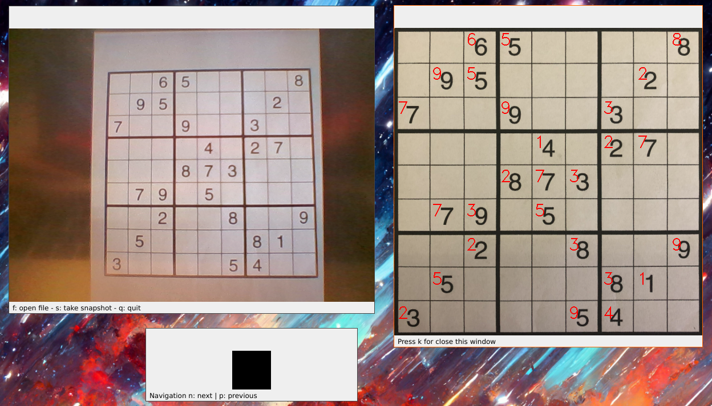

# Can AI read sudoku
Implementation of an OCR for the Sudoku game using OpenCV for image analysis and a Convolutional Neural Network for number recognition.  
It is possible to obtain recognition by either capturing a photo via webcam or by uploading a file with the Sudoku photo.

## Files structure
- **rc/cnn.ypynb**: Convolutional Neural Network with corresponding functions.

- **src/digitsCnn.py**: The same CNN as in the notebook for use in predictions.

- **src/errorsClass.py**: Error classes.

- **src/getSquares.py**: Obtaining the 81 squares of the Sudoku.

- **src/main.py**: Main program.

- **src/numberRecongizer.py**: Provides the CNN's predictions on the provided inputs.

## Program interface

